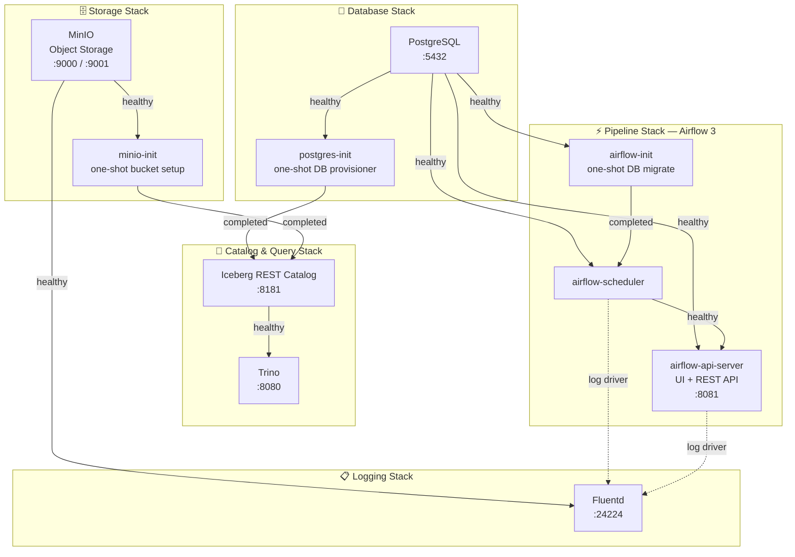

# Local Infrastructure Setup

A modular Docker Compose–based local data engineering platform covering object storage, distributed SQL, workflow orchestration, centralised log shipping, and Kubernetes deployment.

- [Local Infrastructure Setup](#local-infrastructure-setup)
  - [Overview](#overview)
  - [Quick Start](#quick-start)
    - [Setup](#setup)
    - [Git Submodule Guide](#git-submodule-guide)
  - [Secrets Management](#secrets-management)
  - [Docker Compose](#docker-compose)
    - [Container Dependency Diagram](#container-dependency-diagram)
    - [Compose Files](#compose-files)
    - [Common Commands](#common-commands)
  - [Query Engine](#query-engine)
  - [WireMock Mock Server](#wiremock-mock-server)
  - [Nginx Reverse Proxy](#nginx-reverse-proxy)
  - [Airflow DAG Validation](#airflow-dag-validation)
  - [Iceberg REST Image](#iceberg-rest-image)
  - [Kubernetes (Kind) Deployment](#kubernetes-kind-deployment)
  - [Ollama Integration](#ollama-integration)
  - [Architecture](#architecture)

---

## Overview

| Component | Technology | Ports | Purpose |
|-----------|-----------|-------|---------|
| Object Storage | MinIO | 9000 (API), 9001 (Console) | S3-compatible local data lake storage |
| Database | PostgreSQL 16 | 5432 | Iceberg catalog + Airflow metadata |
| Catalog | Iceberg REST | 8181 | Apache Iceberg table catalog (JDBC-backed) |
| Query Engine | Trino 435 | 8080 | Distributed SQL over Iceberg tables |
| Orchestration | Apache Airflow 3 | 8081 (API server) | DAG-based workflow scheduling |
| Log Shipping | Fluentd | 24224 | Centralised log aggregation → MinIO |
| Mock Server | WireMock 3.10 | 8090 | HTTP API mocking for development |
| Reverse Proxy | Nginx | 80 | Unified ingress for all services |

---

## Quick Start

### Setup

```bash
git clone --recurse-submodules https://github.com/avikbesu/local-infra-setup.git
cd local-infra-setup

# Generate secrets into .env.local (auto-runs on first `make up`)
make secrets

# Start the full stack and verify health
make up
make health
```

After cloning, your structure will be:

```
local-infra-setup/
├── dags/                          ← submodule (airflow3-by-example)
│   └── example/
│       └── dags/                  ← actual DAGs folder mounted into Airflow
│           ├── a_basics/
│           ├── b_taskflow/
│           ├── c_operators/
│           ├── d_dynamic_workflows/
│           ├── example_dag.py
│           └── example_taskflow.py
├── compose/
│   └── docker-compose.pipeline.yaml
└── .gitmodules                    ← auto-created
```

### Git Submodule Guide

<details>
<summary>Git Submodule Use Cases</summary>

  1. *Add new submodule at a specified path*
        ```bash
        git submodule add -b main git@github.com:avikbesu/airflow3-by-example.git dags
        git submodule update --init --recursive
        ```
  2. *Keep only dags folder*
        ```bash
        cd dags
        git sparse-checkout init --cone
        git sparse-checkout set example/dags
        ```
  3. *Pull latest changes for a git submodule*
        ```bash
        git submodule update --remote dags
        ```
  4. **[Advanced Usage]** *Make changes in dags folder and push to remote*
        ```bash
        cd dags
        git checkout main
        git pull origin main
        # perform changes and commit them
        git push origin main
        ```

</details>

---

## Secrets Management

```bash
# Generate/regenerate all missing secrets into .env.local
make secrets

# Rotate specific secrets only (others untouched)
make rotate KEYS=MINIO_ROOT_PASSWORD,AIRFLOW_SECRET_KEY
```

Environment files are loaded in order (later values win):
- `.env` — non-secret defaults, committed to git
- `.env.local` — secrets and local overrides, git-ignored (auto-generated by `make up` on first run)

Secrets are defined in `config/secrets.yaml`. Never add secret values to `.env`, `docker-compose*.yaml`, or Helm values files.

---

## Docker Compose

Services are split across multiple Compose files inside `compose/`, grouped by concern. Docker Compose **profiles** control which services start together. The root `makefile` dynamically globs `./compose/docker-compose*.yaml` — adding a new compose file here auto-includes it.

### Container Dependency Diagram



> **Legend**
> - Solid arrows (`-->`) = `depends_on` startup condition
> - Dashed arrows (`-.->`) = Fluentd logging driver (async, not a hard startup dependency)

### Compose Files

| File | Profile(s) | Services |
|------|-----------|---------|
| `docker-compose.storage.yaml` | `storage`, `pipeline` | `minio`, `minio-init` |
| `docker-compose.db.yaml` | `db`, `pipeline`, `query` | `postgres`, `postgres-init` |
| `docker-compose.logging.yaml` | `logging`, `pipeline` | `fluentd` |
| `docker-compose.query.yaml` | `query` | `iceberg-rest`, `trino` |
| `docker-compose.pipeline.yaml` | `pipeline` | `airflow-init`, `airflow-scheduler`, `airflow-api-server` |

### Common Commands

```bash
# Full stack (all profiles)
make up

# Query engine only (Trino + Iceberg + Postgres + MinIO)
make query

# Airflow pipeline only
make pipeline
# or
make up PROFILE=pipeline

# Full stack + nginx reverse proxy
make proxy-up

# Stop all services
make down

# Tail logs for a service
make logs SERVICE=trino

# Shell into a container
make shell SERVICE=trino

# Check container status
make ps

# Validate compose config
make lint

# Health check all services
make health

# Sync git submodules (update DAGs)
make sync
```

---

## Query Engine

```bash
make trino-shell                                          # Interactive Trino CLI
make trino-schemas                                        # List schemas
make trino-tables SCHEMA=my_schema                        # List tables
make trino-describe TABLE=events SCHEMA=my_schema         # Describe a table
make trino-select TABLE=events LIMIT=50                   # Preview rows
make trino-query SQL="SELECT count(*) FROM iceberg.default.events"

make iceberg-namespaces
make iceberg-tables NAMESPACE=my_schema
make iceberg-table-meta NAMESPACE=my_schema TABLE=events
make iceberg-snapshots NAMESPACE=my_schema TABLE=events
```

---

## WireMock Mock Server

```bash
make mock                   # Start mock server (profile: mock)
make mock-reload            # Hot-reload stubs from disk (no restart)
make mock-requests          # View received requests (pretty-printed)
make mock-reset-scenarios   # Reset scenario states
make mock-logs              # Tail WireMock logs
make mock-down              # Stop mock server
```

Stubs live in `config/wiremock/`. Drop a new JSON stub file there and run `make mock-reload` — no restart needed.

---

## Nginx Reverse Proxy

```bash
make proxy-up      # Start full stack + nginx (profile: proxy)
make proxy-down    # Stop full stack + proxy
make proxy-logs    # Tail nginx logs
make proxy-reload  # Hot-reload nginx config (no downtime)
```

---

## Airflow DAG Validation

```bash
make dagcheck
```

---

## Iceberg REST Image

The Iceberg REST image is built locally (not pulled). It uses a custom `entrypoint.sh` to filter credential leakage from JVM logs.

```bash
make build-query   # Build iceberg-rest-local:<ICEBERG_REST_VERSION> (skips if already present)
```

`make query` calls `build-query` automatically. Version is read from `.env` (`ICEBERG_REST_VERSION`, default `1.6.0`).

---

## Kubernetes (Kind) Deployment

```bash
# Prerequisites
make check-deps                          # Verify required tools; add ARGS=--install to auto-install
make helm-repos                          # Add/update Helm repos

# Cluster lifecycle
make kube-up                             # Create cluster + deploy all enabled components
make kube-down                           # Tear down releases then delete cluster
make kube-status                         # Show cluster, releases, pods, port-forward status

# Fine-grained deploy
make kube-deploy                         # Deploy all enabled components
make kube-deploy-one COMPONENT=airflow   # Deploy a single component
make kube-remove                         # Remove all enabled Helm releases (cluster kept)
make kube-remove-one COMPONENT=airflow   # Remove a single release

# Port-forwarding
make kube-port-forward                   # Start background port-forwards
make kube-port-forward-stop             # Kill all kubectl port-forward processes
make kube-port-forward-status           # List running port-forward processes
```

Helm components are defined in `cluster/helm-components.yaml`. Toggle `enabled: true/false` per component. Components declare `depends_on`, `pre_manifests` (kubectl manifests applied before `helm install`), and `port_forward` mappings.

---

## Ollama Integration

```bash
make ollama-install                         # Install latest Ollama
make ollama-check                           # Validate Ollama installation
make ollama-list                            # List downloaded models
make ollama OLLAMA_MODEL=qwen2.5-coder:7b  # Launch Claude Code with Ollama
make ollama-stop                            # Stop Ollama server
```

---

## Architecture

### Compose Structure

All compose files live under `compose/`. The root `makefile` dynamically globs `./compose/docker-compose*.yaml` — **adding a new compose file here auto-includes it**. Profiles control which services activate; there is no single monolithic compose file.

### Dependency Order

```
minio → minio-init → iceberg-rest → trino
postgres → postgres-init → iceberg-rest
postgres → postgres-init → airflow-init → airflow-scheduler → airflow-api-server
minio → fluentd (async, not a hard startup dependency)
```

All `depends_on` entries use `condition: service_healthy` or `condition: service_completed_successfully`. Never bare `depends_on`.

### Airflow 3 Architecture

- `webserver` is replaced by `airflow-api-server` (serves UI + REST API + Task Execution Interface)
- Scheduler requires `AIRFLOW__CORE__EXECUTION_API_SERVER_URL` to know the api-server URL
- Secret key config lives in the `[api]` section, not `[webserver]`
- Health check endpoint: `GET /api/v2/monitor/health`
- DAGs live in the `dags/` git submodule (`airflow3-by-example`), sparse-checked to `example/dags/`

### Modular Makefile

The root `makefile` includes sub-makefiles from `scripts/make/`:
- `query.mk` — Trino SQL + Iceberg REST API targets
- `mock.mk` — WireMock targets
- `ollama.mk` — Ollama LLM targets
- `proxy.mk` — Nginx reverse proxy targets

### Kubernetes Deployment

`scripts/kube-deploy.sh` reads `cluster/helm-components.yaml` and deploys components in dependency order. Each component can declare `pre_manifests` (kubectl apply before helm install) and `port_forward` definitions consumed by `kube-port-forward.sh`.

### Known Issues

1. **Airflow tasks failing**: Dependency order matters — `postgres → airflow-init → airflow-api-server → airflow-scheduler`
2. **Iceberg REST logs credentials**: Mitigated by custom `entrypoint.sh` filtering; not fully resolved via JVM logging config
3. **Iceberg REST logs credentials on startup**: Mitigated by `compose/iceberg-rest/entrypoint.sh`; JVM logging config (logback.xml) approach was attempted but not fully resolved — see issue #31
4. **Trino `query.max-total-memory-per-node`**: Removed — property was defunct in Trino 435

---

> For contribution workflow, project structure, and change guidelines, see [CONTRIBUTING.md](CONTRIBUTING.md).
