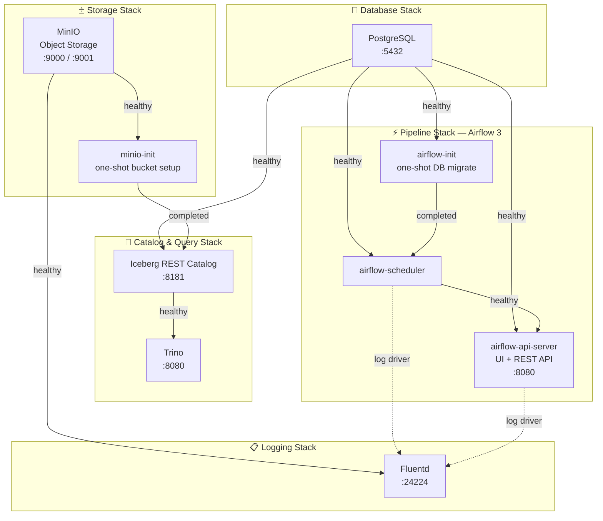

# Local Infrastructure Setup

A modular Docker Compose–based local data engineering platform covering object storage, distributed SQL, workflow orchestration, and centralised log shipping.

---

## Table of Contents

- [Overview](#overview)
- [Docker Compose](#docker-compose)
  - [Container Dependency Diagram](#container-dependency-diagram)
  - [Compose Files](#compose-files)
  - [Quick Start](#quick-start)

---

## Overview

| Component | Technology | Purpose |
|-----------|-----------|---------|
| Object Storage | MinIO | S3-compatible local data lake storage |
| Catalog | Iceberg REST + PostgreSQL | Apache Iceberg table catalog (JDBC-backed) |
| Query Engine | Trino | Distributed SQL over Iceberg tables |
| Orchestration | Apache Airflow 3 | DAG-based workflow scheduling |
| Log Shipping | Fluentd | Centralised log aggregation → MinIO |

---

## Docker Compose

The infrastructure is split across multiple Compose files inside the `compose/` directory, grouped by concern. Docker Compose **profiles** control which services start together.

### Container Dependency Diagram



> **Legend**
> - Solid arrows (`-->`) = `depends_on` startup condition
> - Dashed arrows (`-.->`) = Fluentd logging driver (async, not a hard startup dependency)

### Compose Files

| File | Profile(s) | Services |
|------|-----------|---------|
| `docker-compose.yml` | _(default / core iceberg stack)_ | `minio`, `minio-init`, `postgres`, `iceberg-rest`, `trino` |
| `docker-compose.storage.yaml` | `storage`, `pipeline` | `minio`, `minio-init` |
| `docker-compose.db.yaml` | `db`, `pipeline`, `query` | `postgres` |
| `docker-compose.logging.yaml` | `logging`, `pipeline` | `fluentd` |
| `docker-compose.pipeline.yaml` | `pipeline` | `airflow-init`, `airflow-scheduler`, `airflow-api-server` |

### Quick Start

```bash
# Full pipeline stack (storage + db + logging + airflow)
docker compose \
  -f compose/docker-compose.storage.yaml \
  -f compose/docker-compose.db.yaml \
  -f compose/docker-compose.logging.yaml \
  -f compose/docker-compose.pipeline.yaml \
  --profile pipeline up -d

# Core iceberg/trino stack only (docker-compose.yml)
docker compose -f compose/docker-compose.yml up -d

# Storage + logging only
docker compose \
  -f compose/docker-compose.storage.yaml \
  -f compose/docker-compose.logging.yaml \
  --profile storage --profile logging up -d
```
